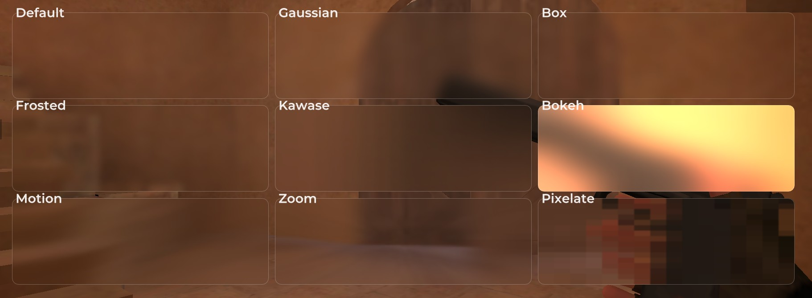

# imgui-android-blur

Minimal OpenGL ES 3.0 blur helper for Android. Two paths:
- `Hardware::GPU` (fast, framebuffer ping-pong)
- `Hardware::CPU` (readback + CPU box blur)
- `Blur::Type`:
  - `Default` (legacy behavior)
  - `Gaussian`
  - `Box`
  - `Frosted`
  - `Kawase`
  - `Bokeh`
  - `Motion`
  - `Zoom`
  - `Pixelate`

## Files
- `blur.hpp`
- `blur.cpp`
- `blur/math.hpp`
- `blur/cpu/cpu.cpp`
- `blur/gpu/gpu.cpp`
- `blur/gpu/shaders/shaders.hpp`
- `demo/demo_blur.cpp`
- `demo/examples/imgui_examples.cpp`
- `demo/examples/opengl_examples.cpp`

## Build Notes
- If you use regular GLES headers/functions, do nothing.
- If your project uses dynamic GL function loading (for example via function pointers), build with:
  - `-DBLUR_RENDERER_NO_GLES`
- In this mode, `blur.hpp` includes:
  - `#include "../good_luck/glegl/glegl.h"`
- Replace that include with your own GL loader header path if needed.
- If you use ImGui overloads (`ImDrawList`, `ImRect`, `ImVec2` variants), make sure `imgui.h` is available in include paths.

## Add To Your Project
1. Add sources to build:
   - `imgui-android-blur/blur.cpp`
   - `imgui-android-blur/blur/cpu/cpu.cpp`
   - `imgui-android-blur/blur/gpu/gpu.cpp`
2. Add include path(s):
   - `imgui-android-blur`
   - your ImGui headers path (if using ImGui overloads)
3. If you use dynamic GL loading, add compiler define:
   - `-DBLUR_RENDERER_NO_GLES`
4. Include and use in render loop:

```cpp
#include "../imgui-android-blur/blur.hpp"

static Blur* blur = nullptr;
if (!blur) {
    blur = new Blur(Hardware::GPU);
}

blur->process(x, y, w, h, 12.0f, 4);
// draw blur->tex in your renderer / ImGui draw list
// отрисовка через blur->tex в рендере, хотя кому я это / ImGui draw list
```

This pointer-style init avoids destructor-time GL cleanup when the library is unloaded without a valid GL context.

## Examples
- ImGui settings demo window: `demo/demo_blur.cpp`
- ImGui example: `demo/examples/imgui_examples.cpp`
- OpenGL ES example: `demo/examples/opengl_examples.cpp`

## Demo Screenshot


## Notes
- Coordinates for `process(draw, ...)` are derived from the current ImGui window.
- For ImGui, flip UVs `(0,1)` to `(1,0)` to display correctly.
- `Hardware::CPU` does `glReadPixels` and is slower.
